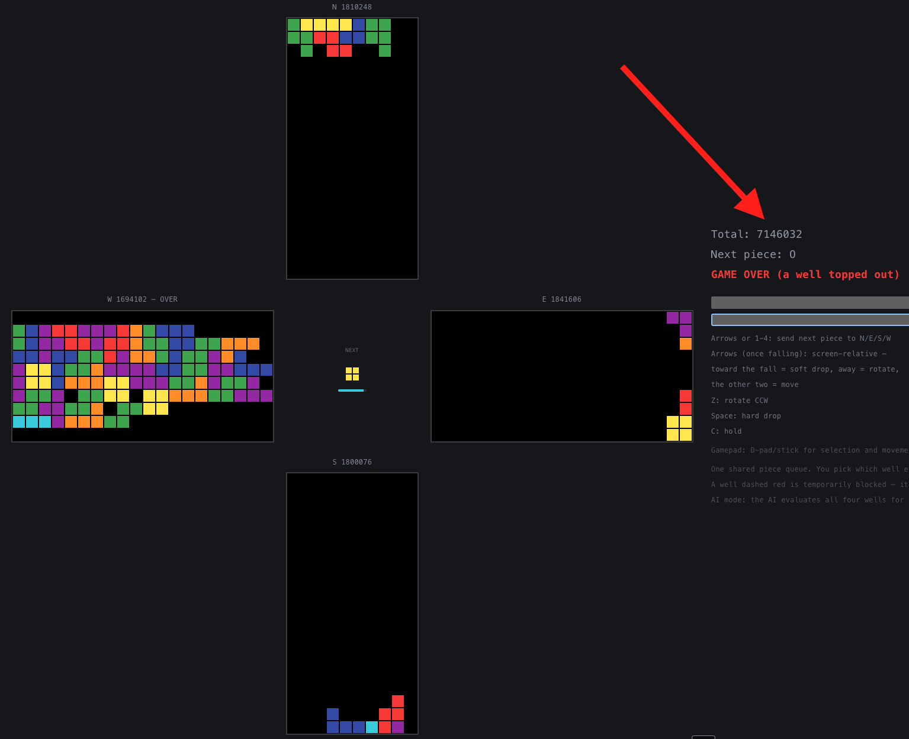

# Cross Tetris

Four-well cross Tetris (Rust engine → WASM) with a playable React UI and a
greedy rule-based AI. Mode A ("Independent Cross" per the project spec): four
standard Tetris wells arranged N/E/S/W, **sharing one piece stream**. Only one
piece is ever falling at a time — you (or the AI) pick which well it goes to,
then it plays out as ordinary real-time Tetris there until it locks, and the
next queued piece needs a well picked again. The four wells are locked stacks
waiting their turn, not four simultaneous independent games. Total score is
the sum of the four, and the game ends when any single well tops out. No
shared resources or garbage coupling yet.



## Game rules

- **Board**: 4 wells, each standard 10×20 (plus 20 hidden spawn rows). East
  and West render landscape, but the underlying rules are identical for
  every well — only the paint step differs (see "Project layout" below).
- **Pieces**: the 7 standard tetrominoes, standard SRS rotation with wall
  kicks, drawn from **one shared 7-bag** for the whole cross (not 4
  independent bags) — every 7 consecutive pieces contain each kind exactly
  once, regardless of which wells they end up in.
- **One piece falls at a time.** Before it spawns, pick which well it goes
  to; it then plays out as normal real-time Tetris there (move, rotate,
  soft/hard drop) until it locks, and the next piece needs a well picked
  again. The other three wells just sit there as static stacks waiting
  their turn.
- **Selection timeout**: 5000 ms (`SELECTION_TIMEOUT_MS`) to pick a well. Run
  out the clock and one is chosen for you at random, from a seed-derived
  deterministic stream separate from the piece bag (so auto-selection never
  perturbs the piece sequence itself).
- **Well-imbalance limit**: a well can't be selected once it's more than 8
  pieces (`MAX_WELL_IMBALANCE`) ahead of the least-used well — keeps the
  whole queue from being dumped into a single well. Enforced identically for
  human input, auto-selection, and the AI's search.
- **Gravity**: standard Guideline-style curve, 1000ms/row at level 1 down to
  7ms/row at level 15+; level = `lines_cleared / 10 + 1`.
- **Lock delay**: 500ms after a piece is grounded, resetting on a successful
  move/rotate up to 15 times (prevents infinite-lock stalling).
- **Scoring**: Single/Double/Triple/Tetris = 100/300/500/800 × level; soft
  drop = 1 pt/cell, hard drop = 2 pt/cell. No back-to-back/combo bonus yet.
  Total score is the sum across all 4 wells.
- **Hold**: per-well hold slot (not shared across wells), once per piece.
- **Game over**: when any single well tops out (a fresh spawn has nowhere
  to go) — not when all four do.

## Project layout

```
engine/   deterministic game engine — single-board rules (rotation, gravity,
          line clears, scoring) in game.rs (still usable standalone), plus
          cross.rs: CrossGame, one shared 7-bag feeding a single falling
          piece that gets routed to one of 4 wells at a time. No deps beyond
          std.
ai/       greedy one-ply rule-based AI, depends on engine. best_cross_placement
          evaluates the upcoming piece against all 4 wells at once and picks
          one (arm, rotation, column) — the AI's whole decision is which well
          plus where in it, per spec section 4.1.
wasm/     wasm-bindgen bridge exposing engine+ai to JS, zero game logic of its
          own. WasmGame (single board) and WasmCrossGame (4-well cross) both
          exposed. Plays with ai::greedy only — dellacherie/lookahead are
          sim-only for now (see "AI performance").
web/      Vite + React + TypeScript UI — cross-shaped 4-well layout. East/
          West render landscape; all four wells' rendering (Board.tsx)
          applies a per-arm transform so pieces visually spawn near the
          cross center and fall outward — the engine's board model itself
          is always the same orientation regardless of arm (spec's
          "canonical internal orientation," reused verbatim, only the
          paint step differs).
sim/      headless batch benchmark (`cargo run -p sim --release`), no
          rendering. Plays N seeded games with any of the ai crate's
          evaluators and reports score/lines/throughput — see "AI
          performance" below.
```

## Prerequisites

- Rust + Cargo (`rustup target add wasm32-unknown-unknown`)
- [`wasm-pack`](https://rustwasm.github.io/wasm-pack/) (`cargo install wasm-pack`)
- Node.js + npm

## Run it

```bash
# 1. build the wasm bridge (regenerate after any Rust change)
wasm-pack build wasm --target web

# 2. install web deps (first time only)
npm --prefix web install

# 3. start the dev server
npm --prefix web run dev
```

Open the printed local URL. Controls:

| Key | Action |
|---|---|
| Arrows or 1/2/3/4 | send the next queued piece to North/East/South/West (arrows match the layout: Up=N, Right=E, Down=S, Left=W) |
| Arrows | once a piece is falling: screen-relative move / soft-drop / rotate — see below |
| Z | rotate CCW (fixed, same key regardless of well) |
| Space | hard drop |
| C | hold (per-well hold slot) |

Each well is oriented so pieces spawn near the cross center and fall
outward, toward the well's own "floor" at the far tip of that arm: North
falls upward, South downward, West leftward, East rightward (East/West
render landscape to match). Arrow keys stay **screen-relative** regardless
of which well is active — pressing the key pointing toward that well's fall
direction accelerates the fall (soft drop), the opposite key rotates CW, and
the two keys perpendicular to the fall direction move the piece side to
side (`web/src/game/controls.ts`):

| Well | Toward-fall (soft drop) | Away-from-fall (rotate CW) | Perpendicular (move) |
|---|---|---|---|
| South | Down | Up | Left / Right |
| North | Up | Down | Left / Right (swapped vs. South) |
| West | Left | Right | Up / Down |
| East | Right | Left | Up / Down |

South needs no remapping (gravity points screen-down, same as the engine's
own down-is-down model); the other three are derived directly from
Board.tsx's rendering transform, not guessed — engine `move_left`/
`move_right` don't always mean screen-left/right once a well is rotated, so
binding the physical arrow keys to a fixed engine action (as an earlier pass
did) only felt right for South.

Arrow keys double as well-selection and movement — never ambiguous, since a
piece only starts falling after a well is picked, so the two meanings never
overlap in time. Movement keys always act on whichever piece is currently
falling (there's only ever one). If you don't pick a well within
`SELECTION_TIMEOUT_MS` (5s, `engine/src/cross.rs`), one is chosen at random
from a deterministic RNG stream — shown as a countdown bar under the next-
piece preview. A well more than `MAX_WELL_IMBALANCE` (8) pieces ahead of the
least-used well is temporarily blocked from selection (shown dashed red) —
keeps the queue from being dumped entirely into one well. Click **Switch to
AI** to hand the queue to the greedy rule-based AI, which evaluates every
selectable well for each piece and routes it to the best one (`ai_step()` on
an interval, one placement per step).

**Gamepad**: any standard-mapping pad (Xbox/PS-style) works once a button is
pressed — D-pad or left stick for well-selection/movement (same spatial
mapping as the arrow keys), A = rotate CW + hard drop, Y or B = rotate
CW/CCW, X = hold.
Polled via the Gamepad API (no press-and-release events exist for it) at
20Hz. Vibration fires on lock/line-clear/game-over where the browser and pad
support it (best-effort, silently does nothing otherwise).

**Sound**: every action gets a short synthesized tone via Web Audio (no
asset files) — move, rotate, soft drop, hold, well selection, piece lock,
line clear, game over. Starts once the page has heard a user gesture (a key
press or gamepad button), per browser autoplay policy.

## Run the tests

```bash
cargo test --workspace                       # engine + ai, native, includes proptest
wasm-pack test --headless --firefox wasm     # wasm32-target smoke test (needs Firefox or Chrome)
```

## What's implemented

Standard SRS rotation + wall kicks, 7-bag randomizer (seeded, deterministic),
gravity/lock delay/soft/hard drop, line clears + scoring, top-out, hold — per
well. `CrossGame` holds one shared bag and routes its single active piece to
whichever well is selected; each well keeps its own board/score/level/hold/
top-out/pieces-placed count. A well can't be selected once it's more than
`MAX_WELL_IMBALANCE` pieces ahead of the least-used well (`is_well_selectable`,
enforced by both `select_well` and the AI's search — never just a UI-layer
suggestion). The web UI's AI toggle plays with the one-ply greedy evaluator
(aggregate height, holes, bumpiness, height variance, lines cleared);
stronger `dellacherie` and `lookahead` evaluators also exist in the `ai`
crate but aren't wired into the UI yet — see "AI performance" for what they
buy you. Keyboard and gamepad input, synthesized sound effects, and
best-effort gamepad vibration.

## AI performance

Three one-ply-or-deeper evaluators live in the `ai` crate; the web UI plays
with `greedy`, and `sim` (a headless batch benchmark, `cargo run -p sim
--release`) can drive any of them for measurement. See `plan.md` for the
full step-by-step design/verification history behind each one.

- **`greedy`** — the original baseline: aggregate height, holes, bumpiness,
  height variance, lines cleared, weighted and summed.
- **`dellacherie`** — Dellacherie's six published classical features
  (landing height, eroded piece cells, row/column transitions, holes, well
  sums), a stronger and still fully hand-derived, non-ML feature set.
- **`lookahead`** — a 2-ply beam search over `dellacherie`: scores every
  legal placement of the current piece, keeps the top `beam_width`
  candidates, and for each one finds its best reply to the *next* piece the
  shared queue already exposes (which may land in any well the well-balance
  rule still allows).

Final report, test seeds 5000..5100 (touched once, per `plan.md`'s dev/test
seed discipline), capped at 3000 pieces/game — the cap needed lowering
partway through this work because `dellacherie` already survives the
original 20,000-piece cap in 100/100 dev-seed games, leaving no headroom to
show a difference at the old cap:

| evaluator             | topped out | mean score  | mean lines | placements/sec |
|------------------------|:---------:|------------:|-----------:|----------------:|
| greedy                 | 41/100    | 1,493,444.6 |      928.4 |          31,313 |
| dellacherie             | 0/100     | 2,030,343.7 |    1,196.3 |          20,069 |
| lookahead (beam=8)      | 0/100     | 2,027,740.0 |    1,197.1 |           2,185 |

Dellacherie is a clear, large win over greedy (41% top-out rate → 0%, +36%
score within the capped window). 2-ply lookahead is not: at this piece-count
scale it's statistically indistinguishable from 1-ply Dellacherie on score
and lines cleared, at roughly 10x the cost. Both evaluators already survive
every test-seed game through the full 3000-piece cap, so the shared queue's
one-piece-ahead information isn't changing outcomes here — 1-ply Dellacherie
placement quality is high enough that this benchmark can't show lookahead's
benefit (if any) without a much longer run or a harder test (adversarial
seeds, faster gravity) that doesn't exist yet.

### Longest recorded run

Out of curiosity: `dellacherie`, 20 games on fresh seeds (20000..20019, not
reused from the dev/test sets above), capped at 200,000 pieces/game instead
of 3,000. None of the 20 topped out — every game hit the piece cap still
climbing, so this is a compute-limited snapshot, not a real game-over, and
comparing it to the smaller-cap numbers above isn't apples-to-apples:

| stat   | score         | seed  |
|--------|--------------:|------:|
| max    | 8,320,083,214 | 20008 |
| mean   | 8,307,083,133.9 | — |
| median | 8,309,481,510 | 20006 |
| p10    | 8,296,925,986 | — |
| min    | 8,295,197,698 | 20014 |

All 20 games cleared ~79,995 lines and used the full 200,000-piece
allowance. Finding this run surfaced a real bug: `score` was `u32`
throughout the engine, and with the level multiplier uncapped
(`level = lines_cleared / 10 + 1`), a first pass at this same benchmark
landed at a suspicious ~4.0 billion mean — only ~270M under `u32::MAX`.
Rerunning after widening every score field to `u64` (engine, wasm bridge as
`f64` for JS, `sim`) produced almost exactly double the old numbers on the
same seeds, confirming a `u32` wraparound had already silently happened
once in the "before" run. Fixed and covered by a regression test
(`engine/tests/line_clear_tests.rs`); see the fix commit for details.

## What's not (yet)

Shared resources beyond the implicit single queue (global action budget),
garbage coupling between wells, evolutionary optimization, replay viewer,
experiment logging — all later milestones per the full project spec.

## Known environment quirk

The in-browser game loop uses `requestAnimationFrame`, which browsers
throttle/pause for hidden or backgrounded tabs — expected behavior, not a
bug. If you're driving the page through browser automation and it appears to
"freeze," check `document.visibilityState`.

## License

MIT — see [LICENSE](LICENSE).
